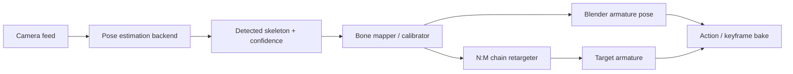

# Project Proposal: BodyMocap

**Working title:** BodyMocap — Camera Body Motion Capture & Armature Retargeting for Blender  
**Document version:** 0.1  
**Date:** 2026-09-18  
**Status:** Draft — seeking approval to proceed to prototype  
**Related:** `SRS.md` (Software Requirements Specification)

---

## 1. Executive Summary

**BodyMocap** is a Blender add-on that turns a webcam into a practical body motion-capture tool inside Blender. The user opens a camera feed, the add-on detects a human skeleton, maps those joints to the character’s armature bones, records movement, and bakes a standard Blender Action that can be applied in one click.

Two capabilities define the product:

1. **Accurate camera→armature bone mapping** (the primary technical risk and value).  
2. **Cross-armature retargeting** when two rigs share the same logical structure but different bone counts (e.g., a 4-bone arm driving a 2-bone arm), using proportional chain mapping and segment aggregation/splitting.

Processing is **local-first** for privacy and offline use. This proposal outlines the problem, solution architecture, MVP vs. later phases, technical approach, success metrics, testing, timeline, roles, risks, and the ask to proceed.

---

## 2. Problem Statement

Animating characters with armatures in Blender is powerful but slow when done entirely by hand. Keyframing body performance—walks, gestures, blocking—consumes hours that many indie animators, students, and small studios cannot spare.

Existing options have gaps for this audience:

| Approach | Limitation for target users |
|----------|----------------------------|
| Manual keyframing | High skill/time cost |
| Full mocap suits / marker studios | Expensive, complex pipeline |
| External mocap apps → FBX import | Context switch; retargeting still painful in Blender |
| Generic auto-rig tools | Do not solve live camera→*existing* armature mapping |

Users need motion capture **inside Blender**, mapped to **their** rig, with a clear path when the source and target skeletons do not have a 1:1 bone count.

---

## 3. Proposed Solution

### 3.1 Concept

BodyMocap ships as a standard Blender 4.x add-on. From a sidebar panel the user:

1. Starts the camera and calibrates in T-pose or A-pose  
2. Reviews the detected skeleton overlay  
3. Accepts or edits joint→bone mapping  
4. Records a take  
5. Bakes to an Action and applies it to the armature  

A parallel workflow retargets an existing Action (or live mapped pose) from one armature to another with N:M bone-chain remapping.

### 3.2 Architecture Overview

Pose estimation runs on-device. A bone mapper converts landmarks into pose-space transforms using hierarchical templates and rest-pose calibration. A retargeter handles chain-length mismatches. Blender receives ordinary pose updates and Action keyframes via `bpy`.

**Pipeline stages (prose):**

1. **Camera** — Capture frames from webcam (optional depth later).  
2. **Pose estimation** — Infer body landmarks (recommended: MediaPipe Pose or equivalent).  
3. **Skeleton** — Filter by confidence; overlay for user feedback.  
4. **Bone mapper** — Hierarchical + manual correspondence; rest-pose offsets and scale.  
5. **Blender armature / Action** — Drive pose bones; bake and one-click apply.  
6. **Retargeter (branch)** — Proportional chain mapping for N→M and M→N transfers.

---

## 4. Key Features

### 4.1 MVP (Phase 1–2 deliverables)

- Install/enable Blender add-on (Windows / macOS / Linux, Blender 4.x)  
- Camera start/stop, preview, mirror toggle, T/A-pose calibration  
- Single-person body detection + skeleton overlay  
- Automatic humanoid mapping + manual override + saveable presets  
- Record / stop / discard take  
- Bake to Action + one-click apply  
- Basic **N:M limb-chain remapping** (validated on 4→2 and 2→4 arm fixtures)  
- Local processing by default; clear errors; tracking status (OK / Degraded / Lost)  
- Documented lighting/motion test pass on a fixture set  

### 4.2 Phase 2+

- IK targets for wrists/ankles for stabler limbs  
- Optional depth-camera scale/foot contact  
- Coarse hands if backend allows (not facial mocap)  
- Smoothing / foot-lock filters  
- Broader rig templates; better auto-map for naming variants  
- Performance pack (GPU path tuning, higher resolution)  
- Optional remote backend only with explicit consent (not default)

**Explicit non-goals for early releases:** multi-person, facial mocap, cloud-required inference, non-humanoid creatures, marker-suit pipelines.

---

## 5. Technical Approach

### 5.1 Delivery vehicle

- Blender **add-on** (`bl_info`, operators, PropertyGroups, N-panel UI)  
- Animation output as standard **Actions** (survives without the add-on after bake)  
- Modal/timer loop for capture; `bpy` updates on main thread  

### 5.2 Pose library choice (rationale)

| Candidate | Fit | Notes |
|-----------|-----|-------|
| **MediaPipe Pose** | Best MVP default | On-device, single-person body landmarks, widely used |
| OpenPose | Fallback | Heavier packaging; multi-person oriented |
| ONNX custom | Later | If accuracy gaps need full control |

**Recommendation:** Prototype with **MediaPipe Pose** behind a `PoseBackend` interface so packaging failures do not rewrite the product. Spike packaging against Blender’s bundled Python in week 1–2 of Phase 1.

### 5.3 Retargeting pipeline

1. **Calibrate** rest poses (source detection ↔ armature; or source armature ↔ target armature).  
2. **Map** semantic chains (spine, arm.L/R, leg.L/R, head).  
3. **Drive FK** bone orientations from landmark bone directions (MVP).  
4. **N:M remap** via proportional arc-length parameterization:  
   - **N > M:** aggregate contiguous source segments (weighted by rest lengths).  
   - **N < M:** split / interpolate orientations along the target chain.  
5. **Bake** deltas into the target Action.  

IK hybrid and advanced constraints are Phase 2 unless the prototype proves FK insufficient for acceptance tests.

### 5.4 Privacy and dependencies

- Default: local frames → local model → local Blender data  
- Pin and document third-party wheels; no silent network model fetch during capture  
- Optional debug video only when user enables it  

Full requirement IDs and acceptance language live in `SRS.md`.

---

## 6. Success Metrics / Acceptance

Metrics below are **proposed targets** for agreement during prototype—not claimed measured benchmarks.

| Area | Proposed success signal |
|------|-------------------------|
| Workflow | User completes calibrate → map → record ≥5 s → bake → apply without developer help |
| Tracking UX | Tracking status visible; no Blender hang on camera loss |
| Mapping | Major limbs follow performer under office lighting on reference humanoid |
| Robustness | Fixture matrix (lighting × motion) executed; failures logged, not crashed |
| Retarget | 4→2 and 2→4 arm fixtures look plausible in side-by-side review; end-effector error within thresholds set in prototype |
| Performance | Proposed ≥15 FPS CPU path on agreed reference laptop; ≥24 FPS with acceleration when available |
| Privacy | Default path performs inference without remote upload |

Formal verification methods are listed in SRS Section 8–9.

---

## 7. Testing Plan

### 7.1 Lighting conditions

Bright diffuse daylight, typical indoor ceiling light, dim indoor, strong backlight / silhouette.

### 7.2 Motion types

Idle standing, walk-in-place, overhead reach, low reach, torso twist, rapid arm wave, sit-to-stand if fully framed.

### 7.3 Armature complexity

1. Simple humanoid (~15–20 bones)  
2. Production-like humanoid (multi-bone spine, 4-segment arms)  
3. Reduced rig (2-bone arms) for remapping validation  

### 7.4 Method

- Record short fixture videos for regression  
- Scripted replay through mapper/retargeter math where possible  
- Visual review checklist signed off per phase gate  
- Publish measured numbers only; keep SRS targets labeled “proposed” until then  

---

## 8. Phases and Timeline

Relative effort estimates (not calendar commitments tied to a start date). Adjust after the packaging spike.

| Phase | Duration | Focus | Deliverables |
|-------|----------|--------|--------------|
| **Phase 1 — Spike & skeleton** | 2–3 weeks | Feasibility | Add-on shell; camera preview; MediaPipe (or fallback) behind interface; overlay; risk report on packaging |
| **Phase 2 — MVP capture** | 4–6 weeks | Core value | Calibration; auto/manual mapping; record; bake Action; one-click apply; basic logging; draft user doc |
| **Phase 3 — Retarget & harden** | 3–4 weeks | Differentiator | N:M chain remapper; 4→2 / 2→4 fixtures; lighting/motion test report; performance pass; mapping presets |
| **Phase 4 — Polish & handoff** | 2–3 weeks | Release readiness | UX polish; optional smoothers; packaging for Win/macOS/Linux; demo reel; SRS update to “Accepted for v1” |

**Total indicative span:** ~11–16 weeks for a small team to a demo-ready v1, contingent on Phase 1 spike results.

---

## 9. Team Roles (Placeholders)

| Role | Responsibility |
|------|----------------|
| **Technical lead / Blender TD** | Add-on architecture, `bpy` integration, Action bake |
| **CV / ML engineer** | Pose backend integration, confidence policy, performance |
| **Animation / rigging advisor** | Mapping templates, retarget quality criteria, fixture armatures |
| **QA** | Lighting/motion matrix, OS install matrix, regression fixtures |
| **Product owner (stakeholder)** | Prioritize MVP cuts, accept phase gates |

Roles may be combined for a small team; Phase 1 can start with 1–2 engineers plus stakeholder review.

---

## 10. Risks and Mitigations

| Risk | Mitigation |
|------|------------|
| Hard to package ML stack into Blender’s Python | Early spike; backend interface; OpenCV-only preview fallback; documented wheel install |
| Monocular depth / scale / foot skate | Mandatory rest-pose calibration; optional depth in Phase 2; don’t over-claim metrical accuracy |
| Auto-map fails on custom bone names | Manual mapper + presets as first-class; hierarchy templates over name-only matching |
| N:M remap looks wrong on stylized rigs | Proportional length weights; visual fixture gate; tunable chain split parameter |
| UI freezes | Modal operators, lower preview resolution, profile FPS early |
| License / distribution constraints on backends | Confirm licenses before public release; keep optional backends pluggable |

---

## 11. Next Steps / Ask

**Ask:** Approve proceeding to **Phase 1 (prototype spike)** with the BodyMocap scope described here and detailed in `SRS.md`.

Immediate next actions after approval:

1. Confirm Blender minor version target and OS priority order  
2. Run pose-backend packaging spike (MediaPipe first)  
3. Build camera + overlay vertical slice in an add-on stub  
4. Agree proposed numeric targets for FPS and retarget error budgets  
5. Schedule Phase 1 demo / go-no-go review  

Upon Phase 1 go, commit to MVP (Phase 2) and retarget hardening (Phase 3) per the timeline above.

---

## 12. Document History

| Version | Date | Changes |
|---------|------|---------|
| 0.1 | 2026-09-18 | Initial project proposal |

---

*End of Proposal*
